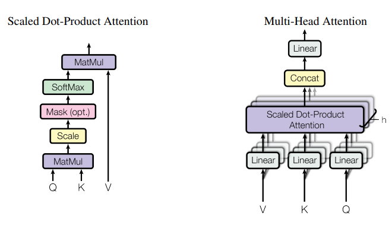
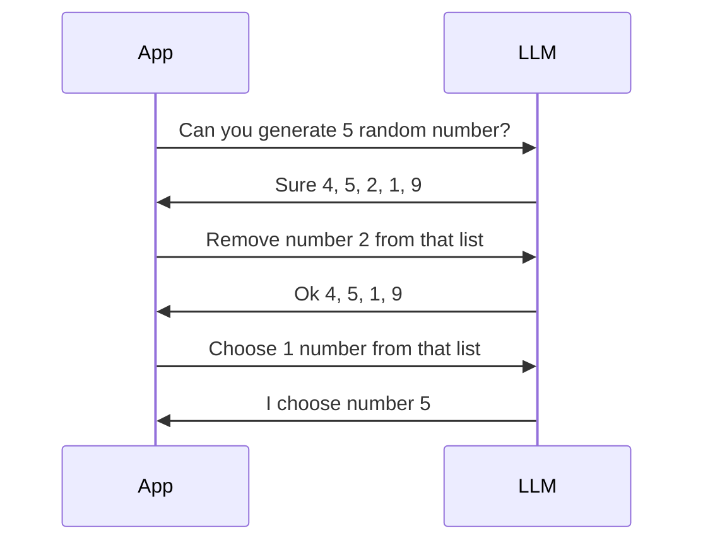
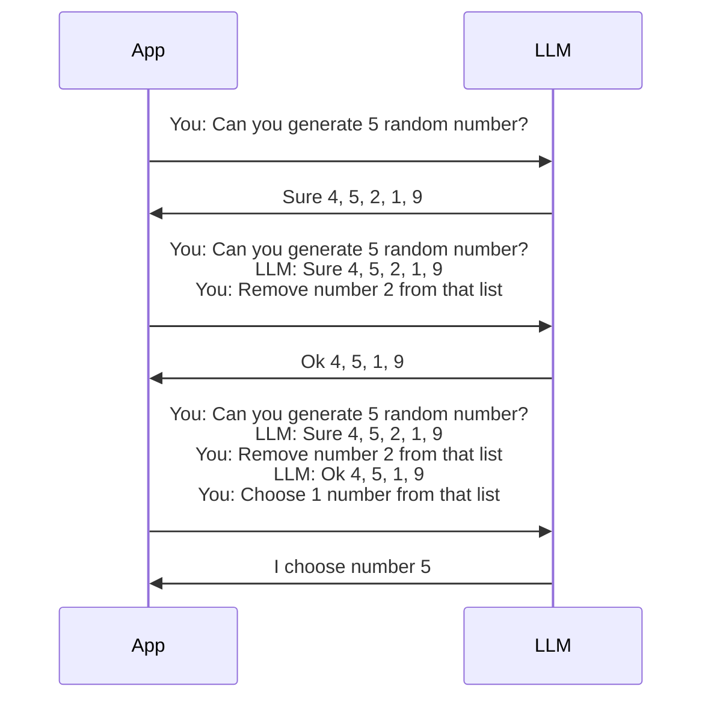
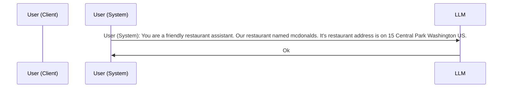
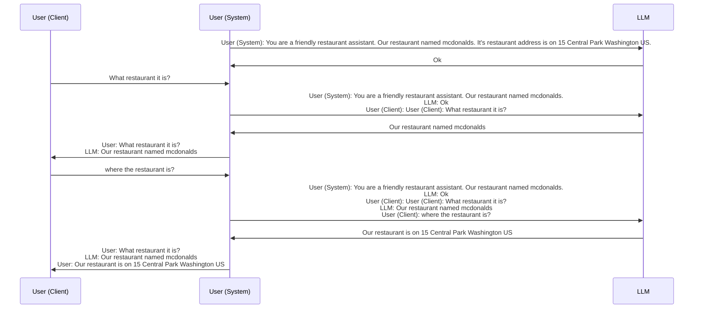
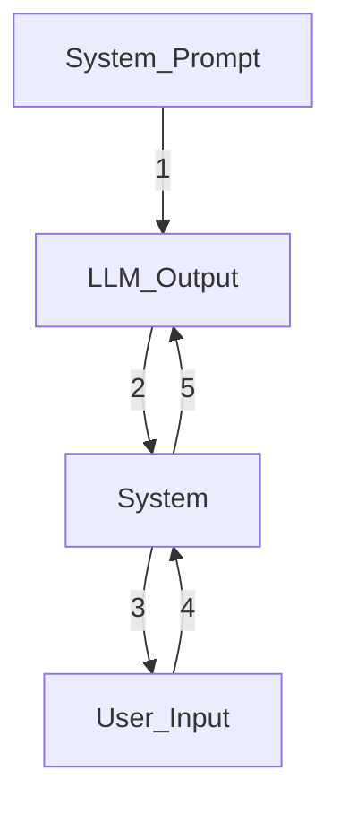
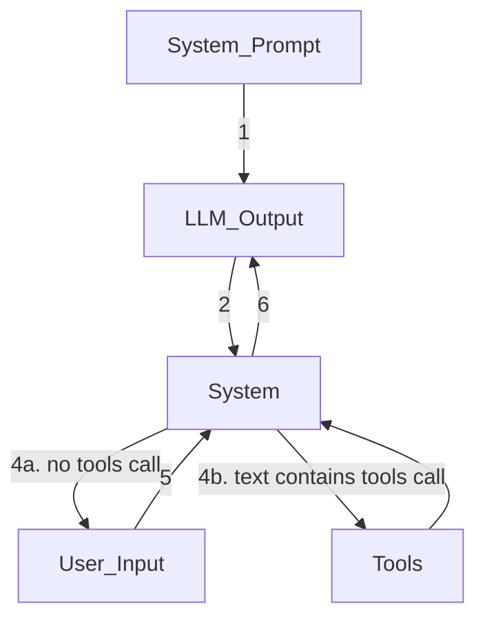
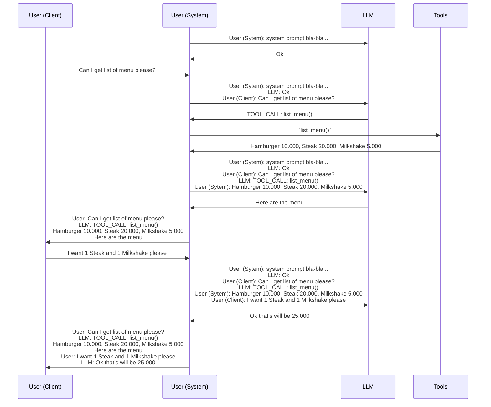

# OpenClaw Behind The Scene

Have you ever wonder how LLM access your file system, accessing social media or do a websearch? does it
even possible? let's see the architecture of LLM model. Based on the paper that start it all [attention is all you need](https://arxiv.org/pdf/1706.03762) LLM used technique called Attention layer. 


Attention layer doesn't stated the input and the output must be an text, image or audio. As long as the data can be transform in to a number (aka embeddings in reseach term) it can be feed in to LLM. You can see the visualization of attention layer from this website [https://poloclub.github.io/transformer-explainer/](https://poloclub.github.io/transformer-explainer/) (shoot out for poloclub that create this amazing visualizer).


Ok we found that it's not limited to text, image or audio. So what training data do popular LLM (GPT, Gemini, Claude) used.

| LLM Provider | Data | Source |
|--|--|--|
| Open AI (GPT) | public internet data + RLHF | https://openai.com/index/gpt-4-research/ |
| Anthropic (Claude) | public internet data with constitution | https://www.anthropic.com/transparency |
| Google (Gemini) | public internet data + RLHF | https://gemini.google/overview/ |

As we know most of data on public internet are text, image or audio. And most embbeding tools (data to number) converted text, image or audio to number and vice versa. So I highly sure that they use text, image and audio as training data (DISCLAIMER CMIIW I can be wrong about it since I don't have access to their training data).


The question is can tools like web search, social media chat or file system embedded in to number so it can be used as training data? Currently there is no embbeding algorithm to convert those tools in to number. Even if we can embbed those tools It will be economically inefficient. You have to retrain the model every time there is new tools. It will cost high amount of money and time.


So how Openclaw, Claude Code, Github Copilot and other AI agent access those tools? Before I revealing their secret we must know how chat on LLM works. Let's say I have LLM chat like these:

```
You: Can you generate 5 random number?
LLM: Sure 4, 5, 2, 1, 9
You: Remove number 2 from that list
LLM: Ok 4, 5, 1, 9
You: Choose 1 number from that list
LLM: I choose number 5
```
Maybe you think behind the scene the code is like this

This not how the code work behind the scene. You must include the previous chat as well

Let's continue. Let's say we want to create chatbot for our restaurant. First we separated chat into 3 actor:
1. User (Client): is chat that inputed by client who use the app
2. LLM: is the chat that ouput by LLM
3. User (System): is chat that inputed by application. it's considered as User by LLM. hidden from Client.

First we have to tell the LLM to act as a restaurant assitant. We will act as User (System) in order to tell the AI (this is called system prompt).


then let user use the chat.

Ok but there is no tools on the example. Let's add tools on the example. Let's say I have tools (python function) like these:
```python
def list_menu() -> list[tuple[str, int]]:
    """return list of menu and it's priced"""
    ...

def search_menu(keyword: str) -> list[tuple[str, int]]:
    """search menu by name"""
    ...
```
The trick is to use some specific text that LLM must use in order to call the tools. Here's the system prompt
```
You are a helpful and friendly restaurant assistant.

You can ask for tools using these exact strings:
- TOOL_CALL: list_menu()
- TOOL_CALL: search_menu("keyword")
```
Before using tools the flow it's like this

Then we will change how we response based on the text outputed by LLM. 

here's chat example using tools call


Using text parsing to call tools right now is considered bad practice. You must use tools call provide by your sdk.
| SDK Provider | docs |
|--|--|
| OpenAI | https://developers.openai.com/api/docs/guides/tools?tool-type=function-calling |
| Antrophic | - https://platform.claude.com/docs/en/agents-and-tools/tool-use/define-tools <br> - https://platform.claude.com/docs/en/agents-and-tools/tool-use/handle-tool-calls | 
| Google | https://ai.google.dev/gemini-api/docs/generate-content/function-calling |
| Ollama | https://docs.ollama.com/capabilities/tool-calling |
| Open Router | https://openrouter.ai/docs/guides/features/tool-calling |

I still show the example using text parsing because that's what happening under the hood.


Using tools call function had a disadvantage It not reusable. If I want to using the tools using other SDK I have to code again. And the most hard part is how about if I want to connect my tools to existing agent provider such as OpenClaw, Hermes, Cursor or Copilot.


Luckily there is a protocol called [MCP](https://modelcontextprotocol.io/docs/getting-started/intro). TLDR MCP is a standard for LLM Tooling. So every tools that use MCP protocol can integrated easily with agent that support MCP. MCP has three mode:
1. stdio (execute script directly, can't be connected remotely)
2. sse (will be depreceated, can be connected remotely)
3. streamable-http (sse replacement, can be connected remotely)
 
You can see mcp tools in [restauran_tools.py](./restaurant_tools.py) and how to connect using copilot on [copilot doc](https://code.visualstudio.com/docs/agent-customization/mcp-servers).


That's all guys. I hope this blog can help you to create your first AI Agent. Happy Coding :) :tada:
